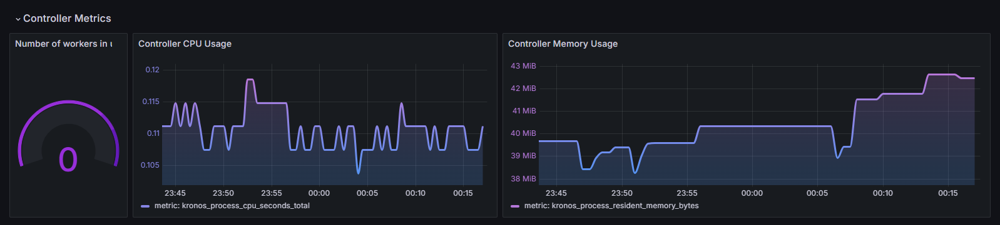
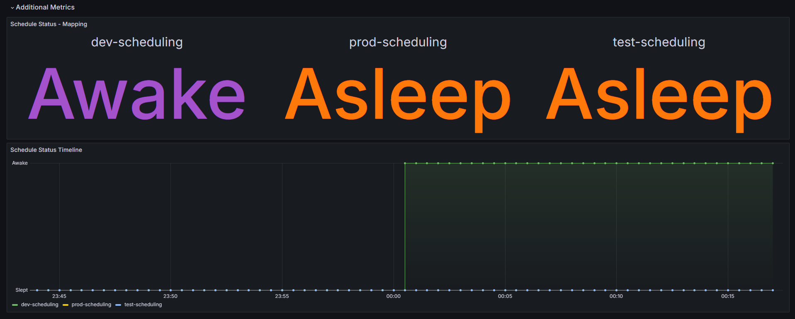

# Metrics
## Default Controller Metrics

Controller Runtime, a part of the Kubebuilder framework, exports several default metrics that offer insights into the performance and behavior of controllers. 
Examples: 
- process_cpu_seconds_total
- process_resident_memory_bytes

These metrics offer valuable information for monitoring and optimizing controller performance. For a comprehensive list of default metrics and their descriptions, refer to the official metrics reference page: [Kubebuilder Metrics Reference](https://book.kubebuilder.io/reference/metrics-reference).
## Exposing Additional Prometheus Metrics

Kronos Operator exposes additional Prometheus metrics at path `/metrics` and port `8443`. These metrics are crucial for monitoring the scheduling status of Kronos Custom Resources (CRs). Currently, the operator provides a single metric, `schedule_info`, which gives detailed information about the scheduling status of each individual Kronos CR.

To scrape these metrics, it is recommended to configure `Prometheus` either directly or using the `ServiceMonitor` Custom Resource Definition (CRD) managed by the Prometheus Operator. By scraping these metrics, operators and administrators can gain valuable insights into the scheduling behavior of Kronos CRs.

## Metric Example

| Name | Type | Example | Value |
|------|------|---------|-------|
| schedule_info | Gauge | kronos_schedule_info\{name ="\<crd-name>", namespace ="\<crd-namespace>"} | 0:`Asleep`  1:`Awake`

:::note 
To ensure smooth integration and avoid conflicts with metrics from other operators, we strongly recommend prefixing (e.g. **`kronos_`**) both default and additional metrics generated by Kronos. This practice helps maintain metric uniqueness and clarity within your Prometheus instance.