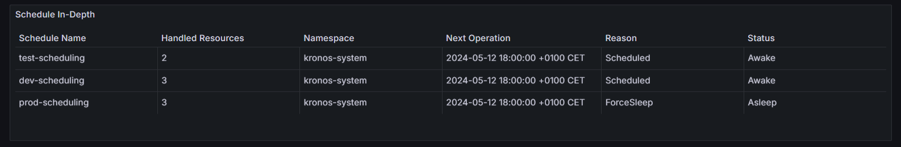

:::tip 
The screenshots of the metrics visualizations provided in this documentation are taken from Kronos' own Grafana dashboard, **KronosBoard**. If you want a powerful and user-friendly way to manage and monitor your Kronos deployment, we highly recommend visiting and using [KronosBoard](https://grafana.com/grafana/dashboards/21068-kronosboard/).
:::

# Metrics
## Default Controller Metrics

Controller Runtime, a part of the Kubebuilder framework, exports several default metrics that offer insights into the performance and behavior of controllers. 
Examples: 
- process_cpu_seconds_total
- process_resident_memory_bytes

These metrics offer valuable information for monitoring and optimizing controller performance. For a comprehensive list of default metrics and their descriptions, refer to the official metrics reference page: [Kubebuilder Metrics Reference](https://book.kubebuilder.io/reference/metrics-reference).
## Exposing Additional Prometheus Metrics

Kronos Operator exposes additional Prometheus metrics at path `/metrics` and port `8443`. These metrics are crucial for monitoring the scheduling status of Kronos Custom Resources (CRs). Currently, the operator provides a single metric, `schedule_info`, which gives detailed information about the scheduling status of each individual Kronos CR.

To scrape these metrics, it is recommended to configure `Prometheus` either directly or using the `ServiceMonitor` Custom Resource Definition (CRD) managed by the Prometheus Operator. By scraping these metrics, operators and administrators can gain valuable insights into the scheduling behavior of Kronos CRs.

## Metric Example

### Schedule Info

| Name | Type | Example | Value |
|------|------|---------|-------|
| schedule_info | Gauge | kronos_schedule_info\{name ="\<crd-name>", namespace ="\<crd-namespace>"} | 0:`Asleep`  1:`Awake` |

### Indepth Schedule Info 

| Name | Type | Example | Value |
|------|------|---------|-------|
| indepth_schedule_info | Gauge | kronos_indepth_schedule_info\{name ="\<crd-name>", namespace ="\<crd-namespace>", status="", reason="", handled_resources="", next_operation=""} | 0:`Asleep`  1:`Awake` |

The `kronos_indepth_schedule_info` metric provides detailed information about the status and operations of a `KronosApp` Custom Resource (CR) in your Kubernetes cluster. Here’s an explanation of its fields:

#### Fields Breakdown

1. **name**
   - **Description**: The name of the `KronosApp` CR.
   - **Example**: `"prod-scheduling"`

2. **namespace**
   - **Description**: The namespace in which the `KronosApp` CR is located.
   - **Example**: `"default"`

3. **status**
   - **Description**: The current status of the `KronosApp` CR.
   - **Possible Values**:
     - `"Awake"`: The resource is currently active.
     - `"Asleep"`: The resource is currently inactive or in sleep mode.

4. **reason**
   - **Description**: The reason or method for the current status of the `KronosApp` CR. This field provides context on why the resource is in its current state.
   - **Possible Values**:
     - For `Asleep` status:
       - `"scheduled"`: The resource is asleep according to a pre-defined schedule.
       - `"forceSleep"`: The resource was forced into sleep mode, overriding the regular schedule.
       - `"holiday"`: The resource is asleep due to a holiday schedule.
     - For `Awake` status:
       - `"scheduled"`: The resource is awake according to a pre-defined schedule.
       - `"forceWake"`: The resource was forced to wake up, overriding the regular schedule.

5. **handled_resources**
   - **Description**: Information about the resources managed by this `KronosApp` CR. This could include details such as the number of pods, deployments, or other Kubernetes resources being handled.
   - **Example**: `"20"`

6. **next_operation**
   - **Description**: The next scheduled operation or action that the `KronosApp` CR will perform. This could indicate the next time the resource will wake up or go to sleep.
   - **Example**: `"2024-05-20T12:00:00Z"` (indicating the next scheduled time for an operation)

:::note 
To ensure smooth integration and avoid conflicts with metrics from other operators, we strongly recommend prefixing (e.g. **`kronos_`**) both default and additional metrics generated by Kronos. This practice helps maintain metric uniqueness and clarity within your Prometheus instance.